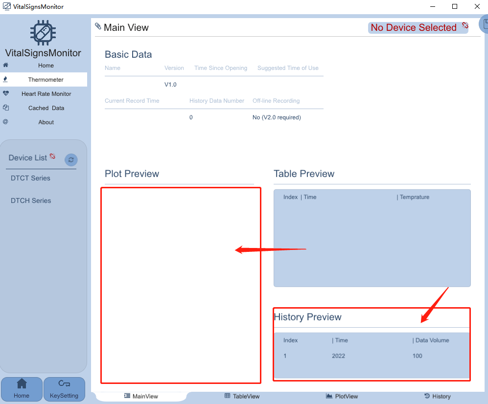
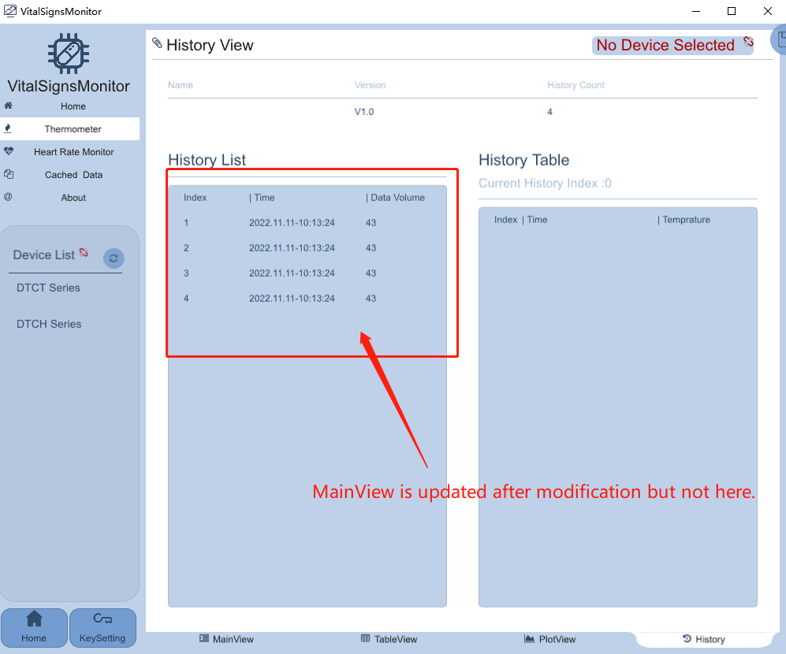
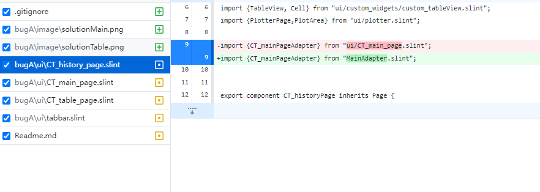
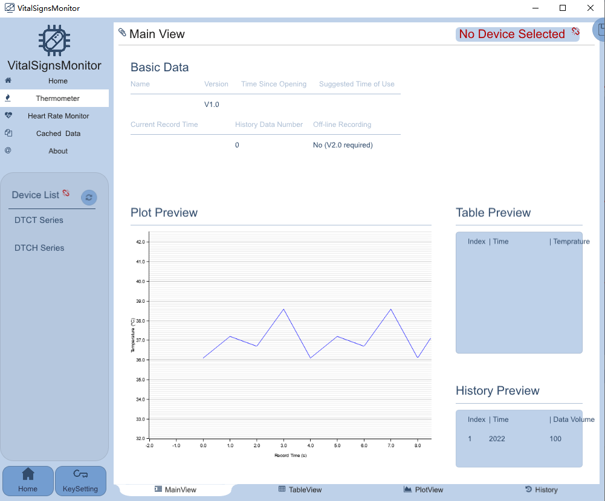
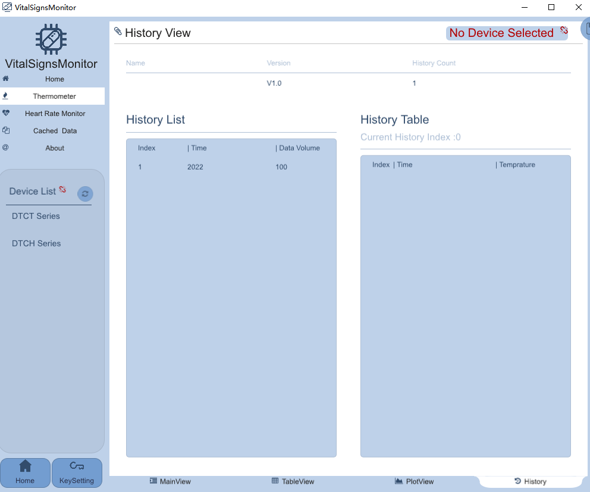

# BUG_A 

Unable to update data ```export global CT_mainPageAdapter```  from ```import {CT_mainPageAdapter} from "ui/CT_main_page.slint";```
in ```mian.rs [212]:         .set_historyPreviewData(show_His_model_now.clone().into());``` The table data was updated, but the references in ``CT_table_page.slint`` were not modified.

and  ```export component PlotArea inherits Image```  has similar bug.






## Interim solutions for BUG_A
The solution to the above problem can be seen in the commit






## Question
in ```temp-display.slint[51]:               if(side-bar.current-item == 3) : PlotArea{}``` Displaying images of plotters does not cause the above bugs.
